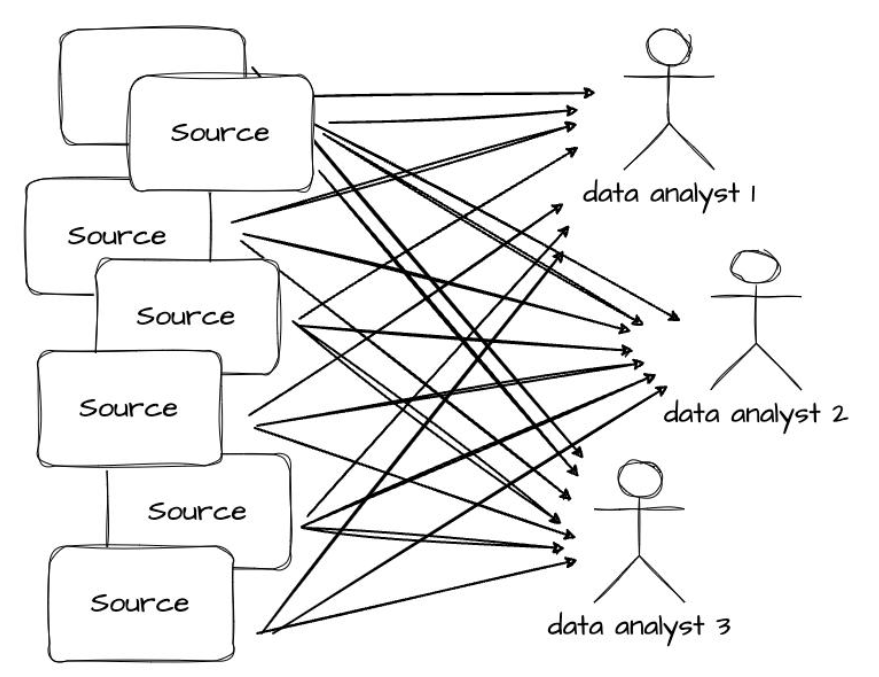
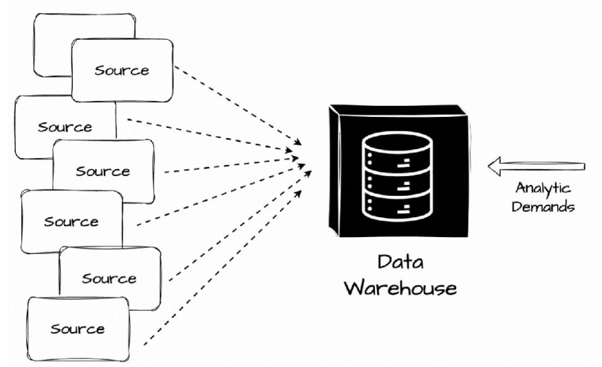
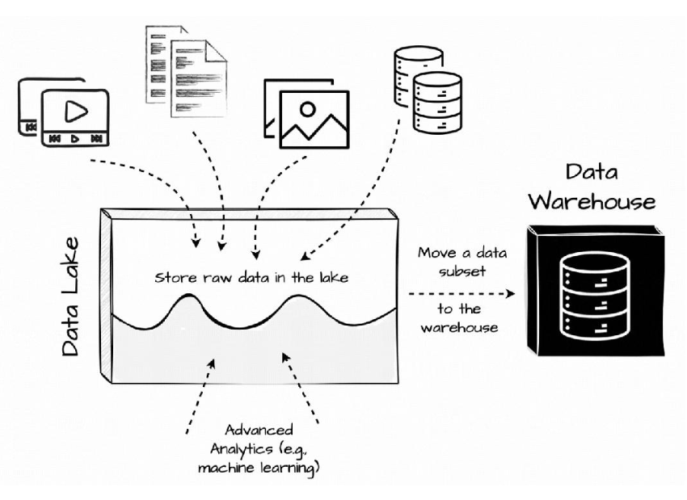
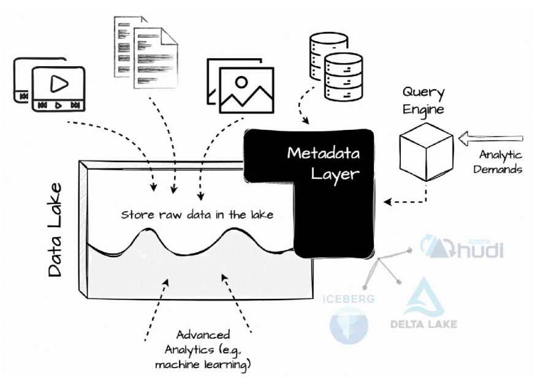

# 数据湖, 数据仓库和 Lakehouse

- **主要参考:** [聊聊数据湖、数据仓库和 Lakehouse](https://36kr.com/p/3101080678829575)

## 数据仓库DataWarehouse

- **DataWarehouse是一个存储库**, 我们可以在其中集中, 存储和管理来自多个数据源的大量数据,  以满足公司的分析工作负载.

- 最初, 数据从**多个来源**提取, 转换为**预定义结构**, 然后直接加载到数据仓库中. 数据仓库通过提供用于数据存储和检索的集中存储库来帮助企业和组织管理数据, 从而实现更高效的数据管理和分析.

- 但数据仓库很快就面临挑战. 数据不仅以表格形式存在, 还可以是视频、音频或文本文档. **非结构化数据**给处理结构化数据的关系数据仓库带来了巨大的麻烦.

## 数据湖DataLake + 数据仓库

- **数据湖**是一个概念, 描述了以**特定格式**存储大量数据的过程. 与传统数据仓库不同, 数据湖**不需要**我们事先定义模式, 因此所有数据包括非结构化数据都可以存储在湖中, 而无需担心约束格式.

- 将数据处理直接放在数据湖上很多严重的缺陷; 由于缺乏数据仓库的适当数据管理功能, 例如数据发现、数据质量和完整性保证、ACID 约束和数据 DML 支持, 数据湖很快就变成了数据沼泽......

- 因此, **将数据湖与数据仓库结合起来是更好的选择**. 我们仍然可以在数据湖中获取任何格式的原始数据, 而无需考虑预定义的模式. 之后, **数据子集** 将被转换并加载到**仓库系统**中进行报告和分析. 机器学习等高级用例仍然可以访问数据湖中的原始数据.

    

## Lakehouse

- 然而，维护上述两层数据架构带来了一些挑战:

- 数据陈旧: 与湖中的数据相比，仓库中的数据陈旧。这与原始数据仓库架构不同，在原始数据仓库架构中，新的运营数据可立即用于分析需求.

- 可靠性: 整合数据湖和仓库非常困难且成本高昂， 需要在两个系统之间进行 ETL 数据的工程工作.

- 对高级分析的支持有限: 最初，数据仓库不能很好地支持机器学习工作负载，因为此类任务需要使用复杂的编程代码处理大型数据集. 供应商通常建议将数据导出到文件，这进一步增加了整个系统的复杂性. 或者，用户可以直接在以开放格式存储的数据湖数据上运行这些工作负载. 然而，这种方法往往以牺牲数据仓库提供的丰富管理功能为代价，例如 ACID 事务或数据版本控制. (这种情况可能不再存在，因为像 BigQuery 这样的现代数据仓库解决方案现在提供了在其界面内直接处理机器学习工作负载的有效功能.)

- 总体拥有成本: 数据湖和仓库中的数据重复将向用户收取双倍的存储成本.

- 因此，Lakehouse 范式被引入了.

- 顾名思义，在 Lakehouse 架构中，人们试图将数据仓库功能直接置于数据湖的顶部.

- 它是一种基于低成本存储 (例如对象存储) 的架构，可增强传统分析型 DBMS 管理和性能功能，例如 ACID 事务、版本控制、缓存和查询优化. Lakehouse 结合了两者的优点.

- 与过去不同的是，当时人们也试图将处理直接引入数据湖，现在引入了更高效的元数据层. Databricks 创建了 Delta Lake，Netflix 创建了 Iceberge 以更有效地在 S3 上管理分析数据，Uber 开发了 Hudi 以将数据更新和增量处理功能引入数据湖.

- 在 Lakhouse 中，每个与数据相关的操作都必须经过这些开放的表格式，以启用表快照、时间过程、ACID、模式和分区演变等数据仓库功能. 这些表格式还记录统计信息，帮助查询引擎处理不必要的数据，例如，最小/最大列值.

    

