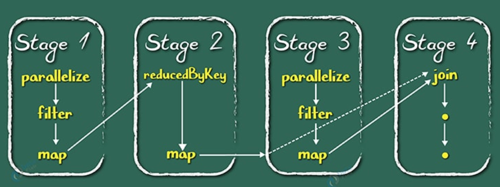
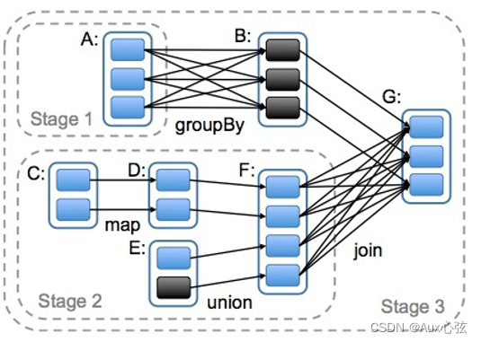

# Spark Concepts & Principles


## 1. Spark Overview


### 1.1 Spark Concepts

- **Spark定义**: Apache Spark是用于大规模数据(large-scala data)处理的统一(unified)分析引擎.

- **Spark起源**: Spark最早源于一篇论文 *Resilient Distributed Datasets: A Fault-Tolerant Abstraction for In-Memory Cluster Computing*, 论文中提出了一种弹性分布式数据集(RDD)的概念.

<p>

- **RDD**: RDD是一种分布式内存抽象,其使得程序员能够在大规模集群中做**内存运算**,并且有一定的**容错**方式.而这也是整个Spark的核心数据结构,Spark整个平台都围绕着RDD进行.

- **Spark**是由**Scala**语言编写的

- 在Spark中, **数据**都叫**RDD**; **方法**都叫**算子**; **计算过程/计算逻辑**都叫**DAG(有向无环图)**.


### 1.2. Spark Components


- **Spark Core**: Spark Core是Spark的核心,它实现了Spark的基本功能,包括任务调度,内存管理,错误恢复,与存储系统交互等. 可以基于多种语言进行编程,如Scala,Java,Python等.

<p>

- **Spark SQL**: 类似于Hive, 基于SQL进行开发, SQL会转化为SparkCore离线程序.

<p>

- **Spark Streaming**: Spark Streaming是Spark的一个模块,它提供了实时流处理能力.它将数据流分割成小的批次,然后使用Spark Core来处理这些批次.


- **Struct Streaming**: Spark Structured Streaming是Spark的一个模块,它提供了结构化流处理能力.它将数据流分割成小的批次,然后使用Spark SQL来处理这些批次.

<p>

- **Spark ML lib**: MLlib是Spark的一个模块,它提供了机器学习算法和工具,包括分类,回归,聚类,协同过滤等.
- **GraphX**: GraphX是Spark的一个模块,它提供了图计算能力,包括图算法,图存储和图计算优化等.


<div style="text-align: center;">
    
</div>


### 1.3. Spark运行的3种模式

- **Local模式**: 本地模式,用于开发和测试,可以在本地机器上运行,不需要集群环境.
- **Standalone模式**: 独立模式,Spark自带的集群管理器,可以在集群上运行,需要配置集群环境.
- **YARN模式**: YARN模式,使用Hadoop YARN作为集群管理器,可以在Hadoop集群上运行,需要配置Hadoop YARN环境.


### 1.4. Spark为什么比mapreduce快

- **内存计算**: Spark将数据保存在内存中,而MapReduce将数据保存在磁盘上,因此Spark的计算速度比MapReduce快.
   
   - 由于 MapReduce 的框架限制, 一个 MapReduce 任务只能包含一次 Map 和一次 Reduce. 计算完成之后, MapReduce 会将运算结果写回到磁盘中(更准确地说是分布式存储系统)供下次计算使用. 如果所做的运算涉及大量循环, 那么整个计算过程会不断重复地往磁盘里读写中间结果. 这样的读写数据会引起大量的网络传输以及磁盘读写, 极其耗时. 而且它们都是没什么实际价值的废操作. 因为上一次循环的结果会立马被下一次使用, 完全没必要将其写入磁盘.

   - **DAG执行引擎**: Spark使用DAG(Directed Acyclic Graph)执行引擎,可以将多个操作合并成一个任务,减少了shuffle和数据落地磁盘的次数. 所以一个Spark 任务并不止包含一个Map 和一个Reduce, 而是由一系列的Map、Reduce构成. 这样, 计算的中间结果可以高效地转给下一个计算步骤, 提高算法性能.


<p>

- MR计算是**进程**级别的, 而Spark是**线程**级别的, 所以Spark的启动速度更快, 执行效率更高.


## 2. Spark基本运行原理


### 2.1. Spark程序运行的层次结构

- 在Spark程序中, 一个**任务**( 或者说**Application**, 比如对一个文件进行`wordcount`)由多个**Job**组成, 一个**Job**由多个**Stage**组成, 一个**Stage**由多个**Task (线程)**组成.

<div style="text-align: center;">
    
</div>


<p>

### 2.2. Spark集群角色

下图是spark的集群角色图, 主要有集群管理节点**cluster manager**, 工作节点**worker**, **执行器executor**, **驱动器driver**和应用程序**application** 五部分组成.


<div style="text-align: center;">
    
</div>


#### 2.2.1. Cluster Manager

**集群管理器**, 主要用来对应用程序申请的资源进行管理. 根据其部署模式的不同, 可以分为`local`, `standalone`, `yarn`等模式.
 - 在`standalone`模式下, 集群管理器在**Master进程/master节点**中.
 - 在 `YARN` 模式下，集群管理器是由 `YARN ResourceManager` 负责.

#### 2.2.2. Worker

worker是spark的工作节点, 主要工作职责有下面四点:

- worker节点cluster manager汇报自身的cpu, 内存等信息.
- worker 节点在cluster manager作用下创建并启用executor, executor是真正的计算单元.
- driver 将任务Task分配给worker节点上的executor并执行运用.
- worker节点同步资源信息和executor状态信息给cluster manager.

**Notice**: 在`yarn` 模式下运行worker节点一般指的是`NodeManager`节点, `standalone`模式下运行一般指的是`worker / slave`节点.


#### 2.2.3. Executor

**执行器**, 是真正执行spark任务的地方, 它是**worker**上的一个进程, 负责运行**Task**, 并将结果返回给**driver**. 每个应用程序都有自己独立的executor, 它们之间是相互独立的, 不会互相影响. Executor创建完成后会向driver反向注册，, 以便driver可以分配task给他执行.


<div style="text-align: center;">
    
</div>

#### 2.2.4. Driver

- 驱动器节点, 它是一个运行Application中**main函数**并创建**SparkContext**的**进程**. 
- driver由资源管理器启动, 它负责**整个Application**的**生命周期管理**.

<p>

- 创建SparkContext的目的是为了准备Spark应用程序的运行环境, 即SparkContext负责和ClusterManager通信, 进行资源的申请(cpu、内存等)、任务的分配和监控等工作. 当程序执行完毕后, SparkContext负责释放资源.

<p>

- Driver节点也负责提交Job, 并将Job转化为Task, 在各个Executor进程间协调Task的调度.

<p>


- Driver根据应用程序执行代码, 将整个程序根据action算子划分成多个job, 每个job内部构建DAG图, DAG Scheduler将DAG图划分为多个stage, 同时每个stage内部划分为多个task, DAG Scheduler将taskset传给Task Scheduer, Task Scheduer负责集群上task的调度.


#### 2.2.5. Application

application是Spark API 编程的应用程序, 它包括实现Driver功能的代码和在程序中各个executor上要执行的代码, 一个application由多个job组成. 其中应用程序的入口为用户所定义的main方法.


### 2.3. RDD

**Definition:** Spark RDD(Resilient Distributed Dataset)是 Spark 中最基本的数据抽象, 它代表一个不可变、可分区、元素可以并行计算的数据集合. RDD是一个数据集的表示, 不仅表示了数据集, **也同时表示了这个数据集从哪来, 以及如何计算.**


***Remark:*** **RDD并不实际存储真正要计算的数据**, 而是记录的数据的位置,数据的转换关系;同时, 所有的RDD转换都是一个惰性求值的过程, 只有当发生一个要求返回结果给driver的action动作时, 才会真正地运行.


#### 2.3.1. RDD不可变性

- 一旦创建, RDD 的数据不可改变. 所有对 RDD 的操作(如 map, filter, reduce 等)都会生成一个**新的 RDD**, 而不会修改原始 RDD.

<p>

- 这种不可变性使得 RDD 在分布式计算环境下非常稳定, 避免了并发冲突.

#### 2.3.2. RDD分区

**RDD是一组分区(list of partitions)**. 每个分区在集群中的不同worker节点上, 并由一个计算任务来处理.RDD是逻辑概念, 分区是**物理概念**. 用户可以在创建RDD时指定RDD的分片个数, 如果没有指定, 那么就会采用默认值.默认值就是**程序所分配到的CPU Core的数目**


- **Partitioner(RDD分片函数)**: 决定RDD如何进行分区, RDD的分区函数决定了数据如何分布到各个节点上.
   - 基于哈希的HashPartitioner, (key.hashcode % 分区数= 分区号). 它是默认值.
   - 基于范围的RangePartitioner. 
   - 只有对于key-value的RDD,并且产生shuffle, 才会有Partitioner;
   - 非key-value的RDD的Parititioner的值是None


- **每个分区的都有计算函数(function for computing each split)**: 在RDD中有一系列函数, 用于"处理计算"每个分区中的数据,这里把"函数"叫算子. 

<p>


```python

# 如果没有指定, 默认数为 spark.default.parallelism, 即程序所分配到的CPU Core的数目
list_rdd = sc.parallelize([1, 2, 3, 4, 5], numSlices=2) # 指定两个分区

# 通过外部读取textFile
#如果没有指定, 则分区数为  min {2, spark.default.parallelism}
file_rdd = sc.textFile("file.txt", minPartitions=6) # 指定6个分区

```

#### 2.3.3. RDD容错性
- RDD 包含血统信息, 记录了该 RDD 如何通过一系列转换操作从原始数据中构建出来.

- 每个 RDD 都有一个或多个**依赖关系**, 表示它是如何由其它 RDD 转换得到的. RDD 之间的依赖关系有两种: 
   - **窄依赖**(Narrow Dependency): 每个父 RDD 的分区对应一个子 RDD 的分区. 例如，`map`、`filter`、`union` 等操作. 
   - **宽依赖**(Wide Dependency): 父 RDD 的一个分区可能会被多个子 RDD 的分区使用. 例如, `groupBy()`、`reduceByKey()` 等操作.


<div style="text-align: center;">
    
</div>


#### 2.3.4. 惰性计算机制

RDD 的转换操作是惰性执行的. 即当用户对 RDD 执行操作时, 这些操作并不会立刻执行, Spark 会首先构建一个 **DAG**, 描述所有的转换步骤. 实际的计算只有在执行 **Action** 操作时才会启动.


#### 2.3.5. RDD操作

- **Transformation(转换):** 是对已有的RDD进行换行生成**新的RDD**, 转换过程采用**惰性计算机制**, 不会立即计算出结果. 常用的方法:
   - map(): 对 RDD 中的每个元素应用一个函数，生成一个新的 RDD
   - filter(): 筛选符合条件的元素，生成一个新的 RDD
   - flatMap(): 类似于 map()，但每个元素可以映射为多个输出元素
   - union(): 合并两个 RDD
   - groupBy(): 按照给定的条件将 RDD 中的数据分组


<p>

- **Action(执行):** 对已有对RDD对数据执行计算产生结果, 并将结果返回Driver或者写入到外部存储中. 常用方法:

   - collect(): 将 RDD 中的所有元素收集到本地
   - count(): 计算 RDD 中元素的数量
   - reduce(): 对 RDD 中的元素进行聚合操作
   - saveAsTextFile(): 将 RDD 中的内容保存到外部文件系统( HDFS)


<div style="text-align: center;">
    
</div>


#### 2.3.6. RDD 的缓存机制


- 某些RDD的计算或转换可能比较耗时, 如果这些RDD后续会被频繁地使用到, 可以考虑将这些RDD进行持久化/缓存, 使用方式如`rdd.cache`

<p>

- RDD通过persist(底层方法)方法或cache方法可以将前面的计算结果缓存, **但是并不是这两个方法被调用时立即缓存**, 而是触发后面的action时，该RDD将会被缓存在计算节点的内存中，并供后面快速重用.

<p>


- 缓存的级别有很多, 默认只存储在内存当中, 在开发中通常使用**memory_and_disk**

```python
# an example
rdd = sc.textFile("file.txt")   # file.txt是订单数据, 大小50MB

rdd.cache()  # 缓存, 不会触发计算, cache is a transformer
rdd.count()  #  第一次计算, 会慢一点, 但是结果已经缓存
rdd.count()  # 两次调用count, 不会重复计算, 因为rdd已经缓存了

```


### 2.4. DAG/Job/Stage/Task

- **DAG**: DAG(Directed Acyclic Graph)有向无环图, 是由一系列**RDD**和**操作**组成的计算流程图. DAG描述了RDD之间的依赖关系, 它表示了数据从输入到输出的整个计算过程.

- **Job**: Job是用户程序一个完整的处理流程, 是逻辑的叫法. 一个Job就是由一个`Action`算子触发的DAG(有向无环图)计算过程. 一个Spark程序可以包含多个Job.

<p>

- **Stage**: 一个Job会被划分为多个Stage. Stage之间是**串行的**, Stage的触发是由一些**shuffle**, **ReduceByKey**的动作产生的.
   
   - 划分Stage的一个依据是RDD间的宽窄依赖. 在对Job中的所有操作划分Stage时,一般会按照倒序进行,即从Action开始,遇到窄依赖操作,则划分到同一个执行阶段,遇到宽依赖操作,则划分一个新的执行阶段,且新的阶段为之前阶段的parent,然后依次类推递归执行

   - child Stage需要等待所有的parent Stage执行完之后才可以执行,这时Stage之间根据依赖关系构成了一个大粒度的DAG.在一个Stage内,所有的操作以串行的Pipeline的方式,由一组Task完成计算.


<p>

- **Task**: 一个Stage由多个Task组成, Task是Spark程序中执行的基本单位, Task之间是并行的. 比如`sc.textFile("/xxxx").map().filter()`, 其中`map`和`filter`就分别是一个`task`. 每个task的输出就是下一个task的输出.

<p>


- **下图为两个Job的stage划分**


<center class="half">


</center>


## 3. Spark Core


<center class="half">

</center>


### 3.1. Spark Core - 基础配置


#### 3.1.1 SparkContext

- SparkContext是Spark应用程序的**入口**,它负责与Spark集群进行通信,并创建RDD、Accumulator和Broadcast等对象.

<p>

- Spark应用程序的提交和执行离不开sparkContext, 它隐藏了网络通信、分布式部署、消息通信、存储体系、计算存储等. 开发人员只需要通过sparkContext等api进行开发即可.


#### 3.1.2. Spark RPC 过程调用

SparkRpc 基于**netty**实现, 分为异步和同步两种方式.

#### 3.1.3. 事件总线
主要用于sparkContext组件间的交换, 它属于监听者模式, 采用异步调用.

#### 3.1.4. 度量系统

主要用于系统的运行监控.


### 3.2. Spark Core - 存储系统

-  **存储系统**管理spark运行中依赖的数据存储方式和存储位置, spark的存储系统优先考虑在各节点以**内存**的方式存储数据, 内存不足时将数据写入磁盘中, 这也是spark计算性能高的重要原因.

<p>

- 我们可以灵活的控制数据存储在内存还是磁盘中, 同时可以通过远程网络调用将结果输出到远程存储中, 比如hdfs, hbase等.


### 3.3. Spark Core - 调度系统

- spark调度系统主要由**DAGScheduler**和**TaskScheduler**组成.

- **DAGScheduler** 主要是把一个**Job**根据**RDD**间的依赖关系, 划分为多个**Stage**, 对于划分后的每个Stage都抽象为一个或多个Task组成的任务集, 并交给**TaskScheduler**来进行进一步的任务调度. 而**TaskScheduler** 负责对每个具体的Task进行调度. 

<p>

- 具体调度算法有**FIFO**, **FAIR**:

   - **FIFO调度** :先进先出, 这是Spark默认的调度模式.
   - **FAIR调度**: 支持将作业分组到池中, 并为每个池设置不同的调度权重, 任务可以按照权重来决定执行顺序.


## 4. 三种工作模式与Web页面介绍

### 4.1 单机模式

- 见 `EnvBuild.md`
- 本地模式启动:  
   ```shell
   conda activate
   /export/server/spark/bin/pyspark --master local[2]

   ```
<p>

- local[2]表示使用2个**cpu**, **local[*]表示使用当前机器上所有可用的CPU核数**.

- 结果文件数与分区数有关, 而分区数与核数有关. 


- 测试：


   ```python

   # map算子实现列表元素平方

   list1 = [1,2,3,4,5,6,7,8,9,10]

   #将列表通过sc.parallelize方法转化为一个分布式集合RDD
   listRdd = sc.parallelize(list1) # sc是SparkContext对象
   #将RDD中的每个分区的数据进行处理
   resultRdd = listRdd.map(lambda x: x ** 2)
   # 将结果RDD的每个元素进行输出
   resultRdd.foreach(lambda x : print(x))


   ```


### 4.2 Spark Standalone模式

- Standalone模式是Spark自带的集群管理器,可以在集群上运行,需要配置集群环境.


<div style="text-align: center;">
    
</div>

- 具体安装见 `EnvBuild.md`

- 集群提交任务:
   ```shell

   # 提交任务 pi.py
   /export/server/spark/bin/spark-submit --master spark://node1:7077 /export/server/spark/examples/src/main/python/pi.py 10

   ```

- 进入集群模式python编程:
   ```shell
   /export/server/spark/bin/pyspark --master spark://node1:7077
   ```


### 4.3. Spark Web页面

- **node1:4040**: 是一个运行的Application在运行的过程中临时绑定的端口, 用以查看当前任务的状态. 有新任务就会有一个4040, 4040被占用会顺延到4041, 4042等. 4040是一个临时端口, 当前程序运行完成后, 4040就会被注销. 4040和Driver相关联, 一个Driver启动起来, 一个4040端口就被绑定起来, 并可以查看该程序的运行状态.


- **node1:8080:** 默认情况是StandAlone下, Master角色(进程)的WEB端口, 用以查看当前Master( 集群)的状态。(Driver和Master是两个东西, Master进程用于管理集群, Driver用于管理某次运行的程序, 某个Driver程序运行完成, 其所绑定的4040端口释放, 但不会影响到Master进程)

- **node1:18080:** 默认是历史服务器的端口( 可以理解为是**历史Driver查看器**), 由于每个程序运行完成, 4040端口就要被注销, 在以后想回看某个程序的运行状态就可以通过历史服务器查看, 历史服务器长期稳定运行, 可供随时查看记录的程序的运行过程.


### 4.4 Spark YARN模式
- YARN模式,使用Hadoop YARN作为集群管理器,可以在Hadoop集群上运行,需要配置Hadoop YARN环境.
- 具体安装见 `EnvBuild.md`


## 5. Spark 算子

## 6. Spark SQL

- spark sql提供了基于sql的数据处理方法, 使得分布式的数据集处理变的更加简单.

- spark sql提供了两种抽象的数据集合DataFrame和DataSet.

- DataFrame 是spark Sql 对结构化数据的抽象,可以简单的理解为spark中的表,相比较于RDD多了数据的表结构信息(schema).

- DataFrame = Data + schema

- RDD是分布式对象集合, DataFrame是分布式Row的集合, 提供了比RDD更丰富的算子, 同时提升了数据的执行效率.

- DataSet 是数据的分布式集合 , 它具有RDD强类型的优点 和Spark SQL优化后执行的优点. DataSet可以由jvm对象构建, 然后使用map,filter, flatmap等操作函数操作.

- 关于Spark SQL可以看这篇文章: [Spark SQL概述及特点详解](https://blog.csdn.net/weixin_45366499/article/details/108816335)


## Other Spark Topics


## Reference

- [大数据面试题：Spark和MapReduce之间的区别？各自优缺点？](https://blog.csdn.net/qq_41544550/article/details/133658290)
- [知乎用户4omIIF对于”MapReduce和Spark的区别是什么“的回答](https://www.zhihu.com/question/53354580)
- [2024-02-21（Spark）](https://blog.csdn.net/weixin_44847812/article/details/136206678#:~:text=4040%EF%BC%9A%E6%98%AF%E4%B8%80%E4%B8%AA%E8%BF%90%E8%A1%8C%E7%9A%84Application%E5%9C%A8%E8%BF%90%E8%A1%8C%E7%9A%84%E8%BF%87%E7%A8%8B%E4%B8%AD%E4%B8%B4%E6%97%B6%E7%BB%91%E5%AE%9A%E7%9A%84%E7%AB%AF%E5%8F%A3%EF%BC%8C%E7%94%A8%E4%BB%A5%E6%9F%A5%E7%9C%8B%E5%BD%93%E5%89%8D%E4%BB%BB%E5%8A%A1%E7%9A%84%E7%8A%B6%E6%80%81%E3%80%82%204040%E8%A2%AB%E5%8D%A0%E7%94%A8%E4%BC%9A%E9%A1%BA%E5%BB%B6%E5%88%B04041%EF%BC%8C4042%E7%AD%89%E3%80%82,4040%E6%98%AF%E4%B8%80%E4%B8%AA%E4%B8%B4%E6%97%B6%E7%AB%AF%E5%8F%A3%EF%BC%8C%E5%BD%93%E5%89%8D%E7%A8%8B%E5%BA%8F%E8%BF%90%E8%A1%8C%E5%AE%8C%E6%88%90%E5%90%8E%EF%BC%8C4040%E5%B0%B1%E4%BC%9A%E8%A2%AB%E6%B3%A8%E9%94%80%E3%80%82%204040%E5%92%8CDriver%E7%9B%B8%E5%85%B3%E8%81%94%EF%BC%8C%E4%B8%80%E4%B8%AADriver%E5%90%AF%E5%8A%A8%E8%B5%B7%E6%9D%A5%EF%BC%8C%E4%B8%80%E4%B8%AA4040%E7%AB%AF%E5%8F%A3%E5%B0%B1%E8%A2%AB%E7%BB%91%E5%AE%9A%E8%B5%B7%E6%9D%A5%EF%BC%8C%E5%B9%B6%E5%8F%AF%E4%BB%A5%E6%9F%A5%E7%9C%8B%E8%AF%A5%E7%A8%8B%E5%BA%8F%E7%9A%84%E8%BF%90%E8%A1%8C%E7%8A%B6%E6%80%81%E3%80%82)
- [大数据开发-Spark-一文理解Spark中的Stage,Executor,Driver...](https://www.cnblogs.com/hulichao/p/14199688.html)
- [Spark学习（二）：RDD详解](https://www.cnblogs.com/pinoky/p/18435294)
- [RDD概念、特点、属性、常见操作、缓存级别](https://blog.csdn.net/qq_14815605/article/details/144272549?utm_medium=distribute.pc_relevant.none-task-blog-2~default~baidujs_baidulandingword~default-4-144272549-blog-139066491.235^v43^pc_blog_bottom_relevance_base4&spm=1001.2101.3001.4242.3&utm_relevant_index=6)
- [Spark运行原理【史上最详细】](https://blog.csdn.net/lovechendongxing/article/details/81746988)
- [Spark工作原理及基础概念（超详细！）](https://blog.csdn.net/weixin_45366499/article/details/110010589)
- [spark-RDD原理与操作(超级详细)](https://blog.csdn.net/weixin_43871785/article/details/130662315?utm_medium=distribute.pc_relevant.none-task-blog-2~default~baidujs_baidulandingword~default-1-130662315-blog-139066491.235^v43^pc_blog_bottom_relevance_base4&spm=1001.2101.3001.4242.2&utm_relevant_index=3)